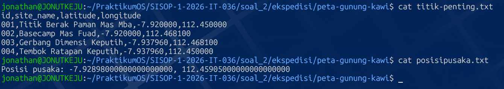
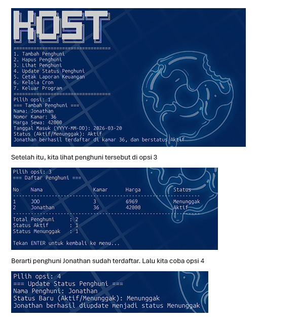
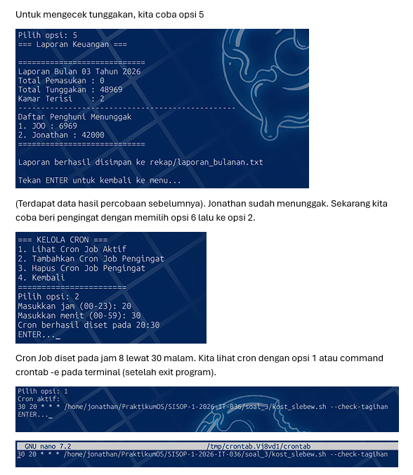
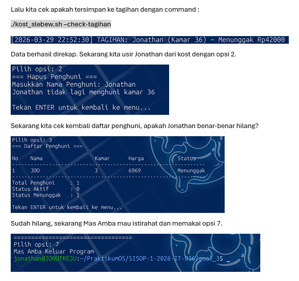

# SISOP-1-2026-IT-036

| Modul 1 |     Identitas Praktikan     |
|---------|-----------------------------|
| Nama    | Jonathan Steven Tjahjaputra |
| NRP     | 5027251036                  |
| Kelas   | Sistem Operasi B            |
| Asisten | SCRA                        |

## Struktur Repository (tanpa assets)
```
.
├── soal_1
│   ├── KANJ.sh
│   └── passenger.csv
├── soal_2
│   └── ekspedisi
│       ├── peta-ekspedisi-amba.pdf
│       └── peta-gunung-kawi
│           ├── gsxtrack.json
│           ├── nemupusaka.sh
│           ├── parserkoordinat.sh
│           ├── posisipusaka.txt
│           └── titik-penting.txt
└── soal_3
    ├── data
    │   └── penghuni.csv
    ├── kost_slebew.sh
    ├── log
    │   └── tagihan.log
    ├── rekap
    │   └── laporan_bulanan.txt
    └── sampah
        └── history_hapus.csv
```

## 1. [soal_1] : ARGO NGAWI JESGEJES

### A. Instruksi
1. Dataset `passenger.csv` harus diunduh ke folder `soal_1`.
2. Script diketik dalam file `KANJ.sh`.
3. Format pemanggilan fungsi pada script adalah :
  ```sh
  awk -f KANJ.sh passenger.csv <opsi>
  ```
4. Opsi `a` : Hitung jumlah penumpang kereta.
5. Opsi `b` : Hitung jumlah gerbong yang dipakai.
6. Opsi `c` : Cari penumpang tertua lalu panggil nama serta usianya.
7. Opsi `d` : Hitung rata-rata usia penumpang (tanpa angka belakang koma).
8. Opsi `e` : Hitung jumlah penumpang business class.
9. Opsi invalid (diluar a / b / c / d / e) akan mengoutput pesan invalid.

### B. Penjelasan
Dimulai dengan setup : Buat folder `soal_1`, unduh `passenger.csv` lalu copy ke WSL lebih tepatnya ke dalam folder `soal_1`,
buat script dengan menjalankan `micro KANJ.sh`.
```sh
BEGIN {
    FS=","
    RS="\r\n"
    mode = ARGV[2]
    ARGV[2] = ""
}
```
1. `FS=","` : Menentukan bahwa pemisah kolom adalah koma (format CSV).
2. `RS="\r\n"` : Mengabaikan enter (\n) dalam pembacaan kolom terakhir (Untuk mencari jumlah gerbong)
3. `NR==1 {next}` : Mengabaikan baris pertama (header).
4. `ARGV[2]` : Menjadikan input setelah `passenger.csv` pada format pemanggilan fungsi sebagai `mode`
Mengambil parameter mode (a / b / c / d / e).


Setelah itu, fungsi dijalankan internal dengan membaca isi `passenger.csv`.
```sh
NR==1 { next }

{
    total++

    carriage[$4]++

    if ($2 > max_age) {
        max_age = $2
        oldest = $1
    }

    sum_age += $2

    if ($3 == "Business") {
        business++
    }
}
```
1. Blok `NR==1 { next }` fungsinya mengabaikan header pada `passenger.csv` yaitu
   `Nama Penumpang | Usia | Kursi Kelas | Gerbong`
2. Blok tanpa nama akan dijalankan saat awk dipanggil, membaca setiap baris pada `passenger.csv`.
3. `total` akan menambah jumlah dirinya sebanyak 1 setiap kali baris dibaca (Jumlah Penumpang).
4. `carriage` akan menyimpan data unik pada kolom 4 (kolom gerbong), secara tidak langsung
   menghitung jumlah gerbong.
5. Blok `if` akan membandingkan kolom 2 pada baris saat ini dengan yang sebelumnya. Jika lebih besar,
   maka kolom 1 (Nama Penumpang) adalah penumpang tertua. Ini akan terus dibandingkan perbaris, yang
   nantinya akan menahan data kolom 1 dan 2 penumpang tertua hingga baris terakhir dibaca.
6. `sum_age` akan menjumlahkan umur (kolom 2) dari setiap baris. Formula rata-rata tidak dijalankan di blok
   ini karena blok sekarang adalah blok perulangan.
7. Blok `if` akan mendeteksi kolom 3 (Kursi Kelas). Jika sel tersebut terdata `Business`, maka jumlah
   variabel `business` bertambah satu.


Dan terakhir untuk bagian per-outputannya,
```sh
END {
    if (mode == "a") {
        print "Jumlah seluruh penumpang KANJ adalah " total " orang"
    }
    else if (mode == "b") {
        print "Jumlah gerbong penumpang KANJ adalah " length(carriage)
    }
    else if (mode == "c") {
        print oldest " adalah penumpang kereta tertua dengan usia " max_age " tahun"
    }
    else if (mode == "d") {
        if (total > 0)
            avg = int(sum_age / total)
        else
            avg = 0
        print "Rata-rata usia penumpang adalah " avg " tahun"
    }
    else if (mode == "e") {
        print "Jumlah penumpang business class ada " business " orang"
    }
    else {
        print "Input Invalid! Gunakan mode: a / b / c / d / e"
    }
}
```
1. Blok `END {}` akan dijalankan setelah semua file berhasil dibaca (dalam konteks ini, `passenger.csv`).
2. awk dengan mode `a`,`c`, dan `e` akan langsung memanggil variabel pada blok tanpa nama.
3. awk `b` memiliki tambahan fungsi `length(_)` yang akan mengukur besar array `carriage`. Hal ini dikarenakan
   data gerbong unik disimpan ke satu "bilik" array, sehingga mengukur lengthnya akan menunjukkan jumlah gerbong.
4. awk `d` menjalankan formula rata-rata terlebih dahulu. Terdapat blok `if` untuk error handling jika pembagi
   adalah nol. Dilakukan dengan menyimpan hasil formula atau nol ke `avg`.
5. awk yang memanggil invalid input akan menampilkan teks invalid seperti pada kode.


### C. Output
Sesuai perintah soal, pemanggilan fungsi script dengan format awk tertera
```sh
awk -f KANJ.sh passenger.csv <opsi>
```


### D. Kendala
Tidak ada kendala

## 2. [soal_2] : EKSPEDISI PESUGIHAN GUNUNG KAWI - MAS AMBA

### A. Instruksi
1. Buat direktori `soal_2`, lalu buat folder `ekspedisi` dan masuk ke dalamnya.
1. Pasang tools `gdown` terlebih dahulu (Butuh tambahan pip dan virtual environment).
2. Dengan `gdown`, download google drive dan unduh file `peta-ekspedisi-amba.pdf` pada docs `Soal Shift Modul 1`.
3. Setelah mengunduh, buat folder baru bernama `peta-gunung-kawi` dan masuk ke dalamnya.
4. Buka file pdf secara "concatonate". Didalamnya terdapat link menuju repository yang tidak dapat diunduh dengan `gdown`.
5. Install paket `git`, lalu cloning tautan repository.
6. Dapatkan file baru dengan melihat isi repo hasil cloning. File tersebut adalah `gsxtrack.json` dengan 4 titik yang memiliki informasi `site_name`, `latitude (x)`, dan `longitude (y)`.
7. Buatlah shell script `parserkoordinat.sh` dengan regex (grep, seed, atau awk) untuk mengambil data-data pada poin 6.
8. Susun hasilnya dengan format `id | site_name | latitude | longitude` perbarisnya dan simpan ke file `titik-penting.txt`. `id` adalah urutan pengambilan dan barisnya harus berurutan kebawah (001, 002, dst).
9. 4 titik membentuk persegi, titik tengahnya adalah posisi pusaka. Hitung dengan formula titik tengah persegi ke script `nemupusaka.sh` dan simpan outputnya ke `posisipusaka.txt` dengan format `Posisi Pusaka : (x, y)`.


### B. Penjelasan
Dimulai dengan setup : Buat folder `soal_2` dan buat folder `ekspedisi` didalamnya, tetapi langsung keluar dari folder dan ciptakan direktori baru untuk path virtual environment. Hal ini dilakukan supaya struktur repository tetap mengikuti aturan. Instalasi virtual environment dilakukan dengan menjalankan command berikut per baris.
```sh
sudo apt update
sudo apt install python3-pip python3-venv -y
python3 -m venv env
source env/bin/activate
```
Lalu instal gdown dengan
```sh
pip install gdown
```
Virtual environment akan langsung aktif.


Setelah instalasi selesai, jalankan command berikut di terminal didalam didalam direktori `soal_2`
```sh
gdown <link gdrive pada Soal Shift Modul 1 soal_2>
```
File `peta-ekspedisi-amba.pdf` akan diunduh. Setelah berhasil diunduh, keluar virtual environment dengan `deactivate` lalu lihat isi pdf dengan `cat`. dibagian akhir isi file akan ada link berikut

[https://github.com/pocongcyber77/peta-gunung-kawi.git](https://github.com/pocongcyber77/peta-gunung-kawi.git)

Lalu untuk proses cloningnya dengan menjalankan seri command berikut.
```sh
sudo apt install git -y
git clone https://github.com/pocongcyber77/peta-gunung-kawi.git
```
(Line pertama khusus jika belum menginstall git). Hasil cloning repository akan langsung bisa diakses pada direktori `soal_2`.


Masuk ke dalam repository. Seperti instruksi pada soal, ada file `gsxtrack.json` didalamnya. Buat file baru `parserkoordinat.sh` dan isinya sebagai berikut.
```sh
#!/bin/bash

echo "id,site_name,latitude,longitude" > titik-penting.txt

grep -E '"site_name"|"latitude"|"longitude"' gsxtrack.json | \
sed 's/[",]//g' | \
awk -F': ' '
/site_name/ {name=$2}
/latitude/ {lat=$2}
/longitude/ {
    lon=$2
    id++
    printf "%03d,%s,%s,%s\n", id, name, lat, lon >> "titik-penting.txt"
}
'
```
1. Karena saya memakai micro, `#!/bin/bash` penting untuk menjalankan script layaknya bash.
2. Line `echo` berfungsi untuk mencatat output ke file baru `titik-penting.txt`.
3. Line `grep` hanya akan mengambil data `site_name`, `latitude`, dan `longitude` dari file `gsxtrack.json`.
4. Line `sed` berfungsi untuk menghapus tanda kutip dan koma di seluruh baris (kerapihan format).
5. Line `awk ' '` berfungsi memperbaiki format menjadi bentuk format pada bagian print.
6. Variabel `id` ditambahkan karena permintaan soal dan nilainya naik 1 perbaris, menandakan urutan.
Isi dari file `titik-penting.txt` adalah berikut.
```
id,site_name,latitude,longitude
001,Titik Berak Paman Mas Mba,-7.920000,112.450000
002,Basecamp Mas Fuad,-7.920000,112.468100
003,Gerbang Dimensi Keputih,-7.937960,112.468100
004,Tembok Ratapan Keputih,-7.937960,112.450000
```
Jika dilihat, titik dengan x dan y yang berbeda adalah pada id `001` dan `003`


Lalu untuk menghitung titik tengahnya dilakukan dengan terlebih dahulu membuat file `nemupusaka.sh` berikut.
```sh
#!/bin/bash

read lat1 lon1 <<< $(awk -F',' 'NR==2 {print $3, $4}' titik-penting.txt)
read lat2 lon2 <<< $(awk -F',' 'NR==4 {print $3, $4}' titik-penting.txt)

mid_lat=$(echo "($lat1 + $lat2)/2" | bc -l)
mid_lon=$(echo "($lon1 + $lon2)/2" | bc -l)

echo "Posisi pusaka: $mid_lat, $mid_lon" > posisipusaka.txt
```
1. Dua line `read` untuk mengambil 2 titik dengan x dan y yang berbeda, yaitu baris pertama dan ketiga (NR==1 adalah header sehingga tidak dihitung).
2. `mid_lat` dan `mid_lon` akan menghitung latitude tengah dan longitude tengah.
3. Line `echo` akan mencetak hasil poin 2 ke file baru `posisipusaka.txt`.
Isi dari file `posisipusaka.txt` adalah sebagai berikut.
```
Posisi pusaka: -7.92898000000000000000, 112.45905000000000000000
```


### C. Output
Karena file `.sh` yang ada hanya mencetak output ke file `.txt`, maka output yang tertera hanya 2 yaitu `titik-penting.txt` dan `posisipusaka.txt`. 


**(Mohon maaf sekali mas/mba asisten, tetapi beberapa elemen "kreatif" pada soal 2 ini mungkin sedikit berlebihan. Secara github ini bakal jadi portofolio nantinya, mungkin kedepannya bisa lebih safe for work)**





### D. Kendala
Tidak ada kendala


## 1. [soal_3] : KOS SLEBEW AMBATUKAM

### A. Instruksi
1. Buat direktori `soal_3` dan file script `kost_slebew.sh` didalamnya.
2. Buat menu interaktif (Amba menginput opsi 1 / 2 / 3 / 4 / 5 / 6 / 7). Beri pesan invalid input jika Amba menginput opsi diluar itu. Sesi opsi diakhiri dengan menekan `ENTER`
3. Opsi `1` : Tambahkan Penghuni Baru
   Minta input `Nama`, `Nomor Kamar`, `Harga Sewa`, `Tanggal Masuk` (format: "YYYY-MM-DD"), `Status Awal` (Aktif/Menunggak).
   Pesan berhasil akan ditampilkan jika mengikuti format, dan pesan gagal jika invalid input.
   Penghuni yang berhasil didaftar disimpan di `soal_3/data/penghuni.csv`.
4. Opsi `2` : Hapus Penghuni
   Minta input `Nama` penghuni yang akan dihapus.
   Pesan berhasil akan ditampilkan jika penghuni ditemukan, dan pesan gagal jika nama tersebut tidak ditemukan.
   Baris data penghuni yang dihapus disimpan di `soal_3/sampah/history_hapus.csv` dengan tambahan kolom `Tanggal Penghapusan` di
   kolom paling belakang.
5. Opsi `3` : Tampilkan Daftar Penghuni
   Baca file `penghuni.csv` dan gunakan awk untuk mengoutput database mentah menjadi tabel rapi.
   Di akhir tabel, buat juga rekap `Total Penghuni`, `Total Status Aktif`, dan `Total Status Menunggak`.
6. Opsi `4` : Update Status Penghuni
   Minta input `Nama` penghuni yang statusnya hendak diubah.
   Mengiikuti format input soal, Amba diminta untuk menginput status baru (walaupun status hanya ada 2 jenis).
   Pesan berhasil akan ditampilkan jika nama penghuni dan format status sudah pas, dan pesan gagal jika tidak.
7. Opsi `5` : Cetak Laporan Keuangan
   Buat script yang akan menghitung otomatis total pemasukan `Aktif` dan tunggakan `Menunggak`.
   Mengikuti format input soal, setelahnya timbulkan juga informasi jumlah kamar terisi dan daftar penghuni menunggak
   (dengan format : "Nomor, Nama, Tunggakan").
   Laporan keuangan disimpan di `soal_3/rekap/laporan_bulanan.txt`.
8. Opsi `6` : Kelola Cron Job
   Jika opsi dijalankan, tampilkan submenu yang interaktif
   Input `1` untuk melihat cron job yang aktif, `2` untuk mendaftarkan cron job (Hanya boleh 1 cron max), default pada jam 7 pagi,
   `3` untuk menghapus cron job saat ini, `4` untuk kembali ke menu utama.
   Pendaftaran cron job dilakukan dengan meminta input `jam`, lalu `menit`. Formatnya harus 2 digit.
9. Opsi `7` : Keluar Program
   Keluar menu utama dan kembali ke terminal.


### B. Penjelasan
Dimulai dengan setup : membuat direktori `soal_3` dan langsung membuat script `kost_slebew.sh`. Seperti pada `soal_2`, dimulai dengan line `#!/bin/bash` karena saya memakai `micro`.


Berikut adalah kode untuk bagian menu interaktif.
```sh
while true; do
    clear 
    echo "██╗  ██╗ ██████╗ ███████╗████████╗ "
    echo "██║  ██║██╔═══██╗██╔════╝╚══██╔══╝ "
    echo "██████═╝██║   ██║███████╗   ██║    "
    echo "██╔══██╗██║   ██║╚════██║   ██║    "
    echo "██║  ██║╚██████╔╝███████║   ██║    "
    echo "╚═╝  ╚═╝ ╚═════╝ ╚══════╝   ╚═╝    "
    echo "=================================="
    echo "1. Tambah Penghuni"
    echo "2. Hapus Penghuni"
    echo "3. Lihat Penghuni"
    echo "4. Update Status Penghuni"
    echo "5. Cetak Laporan Keuangan"
    echo "6. Kelola Cron"
    echo "7. Keluar Program"
    echo "=================================="

    echo -n "Pilih opsi: "
    read pilihan

    case $pilihan in
        1)
            tambah_penghuni
            echo ""
            echo "Tekan ENTER untuk kembali ke menu..."
            read
            ;;
        2)
            hapus_penghuni
            echo ""
            echo "Tekan ENTER untuk kembali ke menu..."
            read
            ;;
        3)
            lihat_penghuni
            echo ""
            echo "Tekan ENTER untuk kembali ke menu..."
            read
            ;;
        4)
            update_status
            echo ""
            echo "Tekan ENTER untuk kembali ke menu..."
            read
            ;;
        5)
            laporan_keuangan
            echo ""
            echo "Tekan ENTER untuk kembali ke menu..."
            read
            ;;
        6)
            kelola_cron
            ;;
        7)
            echo "Mas Amba Keluar Program"
            break
            ;;
        *)
            echo "Pilihan tidak valid"
            read -p "Tekan ENTER..."
            ;;
    esac
done
```
1. Line `while` berfungsi sebagai pembuat loop tak hingga (sampai program di `break`).
2. `read pilihan` akan mencatat opsi yang dipilih dan menyimpannya ke variabel `pilihan`
3. Line `case` adalah blok *switch-case* berdasarkan variabel `pilihan`
4. `read` kosong akan menunggu input `ENTER`
5. Case `7)` memiliki `break` yang menjadi opsi 7 yaitu keluar dari program
6. Case `*)` akan menangani input selain 1 / 2 / 3 / 4 / 5 / 6 / 7 sebagai pesan invalid input.
7. `esac` dan `done` akan menutup blok `case` dan menutup loop `while` (blok `do`).


Kode berikut adalah fungsi `tambah_penghuni` yang dipanggil jika menginput opsi `1`.
```sh
tambah_penghuni() {
    echo "=== Tambah Penghuni ==="

	# Perinputan Masuk Sini
    echo -n "Nama: "
    read nama
    echo -n "Nomor Kamar: "
    read kamar
    echo -n "Harga Sewa: "
    read harga
    echo -n "Tanggal Masuk (YYYY-MM-DD): "
    read tanggal
    echo -n "Status (Aktif/Menunggak): "
    read status

    # Validasi Ini Itu
    if ! [[ "$harga" =~ ^[0-9]+$ ]] || [ "$harga" -le 0 ]; then
        echo "Error: Harga harus angka positif"
        echo "Input invalid, ulangi proses penambahan penghuni"
        return
    fi
    if ! date -d "$tanggal" >/dev/null 2>&1; then
        echo "Error: Format tanggal tidak valid"
        echo "Input invalid, ulangi proses penambahan penghuni"
        return
    fi
    today=$(date +%Y-%m-%d)
    if [[ "$tanggal" > "$today" ]]; then
        echo "Error: Tanggal tidak boleh di masa depan"
        echo "Input invalid, ulangi proses penambahan penghuni"
        return
    fi
    if [[ "$status" != "Aktif" && "$status" != "Menunggak" ]]; then
        echo "Error: Status hanya boleh Aktif atau Menunggak"
        echo "Input invalid, ulangi proses penambahan penghuni"
        return
    fi
    if awk -F',' -v k="$kamar" '$2==k {found=1} END{exit !found}' data/penghuni.csv; then
        echo "Error: Nomor kamar sudah terisi"
        echo "Input invalid, ulangi proses penambahan penghuni"
        return
    fi

    # Ini untuk nyimpan
    echo "$nama,$kamar,$harga,$tanggal,$status" >> data/penghuni.csv
    echo "$nama berhasil terdaftar di kamar $kamar, dan berstatus $status"
}
```
1. Seri line `echo` dan `read` pertama akan membaca input dan menyimpannya ke `nama`, `kamar`, `harga`, `tanggal`, `status`.
2. Seri line `if` adalah validasi. Diantaranya `harga` harus positif, format `tanggal`, `tanggal` melebihi hari ini, format `status`, `kamar` yang sudah ditempati.
3. Khusus blok `if` pengecekan ketersediaan nomor kamar, digunakan awk untuk membaca data `penghuni.csv`.
4. Seri line `echo` diakhir akan mencetak data ke `penghuni.csv` jika berhasil dan mengoutput pesan berhasil.


Kode berikut adalah fungsi `hapus_penghuni` yang dipanggil jika menginput opsi `2`.
```sh
hapus_penghuni() {
    echo "=== Hapus Penghuni ==="

	  # Input lekku
    echo -n "Masukkan Nama Penghuni: "
    read -r nama

    # Cari orangnya
    data=$(awk -F',' -v n="$nama" '$1==n {print $0}' data/penghuni.csv)

	  # Nyari validasi :(
    if [ -z "$data" ]; then
        echo "Penghuni tidak ditemukan, coba lagi!"
        return
    fi

    # Ambil nomor kamar
    kamar=$(echo "$data" | awk -F',' '{print $2}')

    # Copas tanggal sekarang
    today=$(date +%Y-%m-%d)

    # Simpan ke history
    echo "$data,$today" >> sampah/history_hapus.csv

    # Hapus dari file utama
    awk -F',' -v n="$nama" '$1!=n' data/penghuni.csv > data/temp.csv
    mv data/temp.csv data/penghuni.csv

    echo "$nama tidak lagi menghuni kamar $kamar"
}
```
1. Line `data` dan blok `if` akan mencari jika `nama` penghuni benar-benar ada atau tidak.
2. Jika ada, data `nama` dan `kamar` akan dicopy sementara ke variabel yang sama pada fungsi ini.
3. Tambahan variabel `today` untuk menentukan tanggal sekarang.
4. `data` dan `today` dicopy ke file `sampah/history_hapus.csv`.
5. `kamar` tidak dipakai (hanya dihapus) supaya tidak bentrok setelah penghapusan berhasil.
6. Line awk penghapusan akan mencopy data baru (setelah penghuni dihapus) ke file sementara yang nantinya akan *overwrite* file `penghuni.csv`.


Kode berikut adalah fungsi `lihat_penghuni` yang dipanggil jika menginput opsi `3`.
```sh
lihat_penghuni() {
    echo "=== Daftar Penghuni ==="
    echo ""

	# Isinya cuma Peroutputan
    awk -F',' '
    BEGIN {
        printf "%-5s %-20s %-10s %-15s %-12s\n", "No", "Nama", "Kamar", "Harga", "Status"
        print "---------------------------------------------------------------"
    }
    NR > 1 {
        no++
        printf "%-5d %-20s %-10s %-15s %-12s\n", no, $1, $2, $3, $5

        total++
        if ($5 == "Aktif") aktif++
        else if ($5 == "Menunggak") menunggak++
    }
    END {
        print "---------------------------------------------------------------"
        printf "Total Penghuni     : %d\n", total
        printf "Status Aktif       : %d\n", aktif
        printf "Status Menunggak   : %d\n", menunggak
    }
    ' data/penghuni.csv
}
```
Fungsi ini cukup *straightforward* karena hanya berisi perinputan. Namun dibaca dengan line `awk -f',' '_' data/penghuni.csv`. Sangat mirip dengan format pemanggilan pada `soal_1`, bedanya kali ini pada script.


Kode berikut adalah fungsi `lihat_penghuni` yang dipanggil jika menginput opsi `4`.
```sh
update_status() {
    echo "=== Update Status Penghuni ==="

    echo -n "Nama Penghuni: "
    read -r nama

    echo -n "Status Baru (Aktif/Menunggak): "
    read -r status_baru

    # Valid ga banh
    if [[ "$status_baru" != "Aktif" && "$status_baru" != "Menunggak" ]]; then
        echo "Error: Status hanya boleh Aktif atau Menunggak"
        echo "Input invalid, ulangi proses update status"
        return
    fi

    # Valid ga banh pt 2
    if ! awk -F',' -v n="$nama" '$1==n {found=1} END{exit !found}' data/penghuni.csv; then
        echo "Penghuni tidak ditemukan, coba lagi!"
        return
    fi

    # Update status pake awk
    awk -F',' -v n="$nama" -v s="$status_baru" '
    BEGIN {OFS=","}
    NR==1 {print; next}
    {
        if ($1 == n) {
            $5 = s
        }
        print
    }
    ' data/penghuni.csv > data/temp.csv

    mv data/temp.csv data/penghuni.csv

    echo "$nama berhasil diupdate menjadi status $status_baru"
}
```
Kode berikut secara sintaks juga mirip dengan fungsi `hapus_penghuni` sebelumnya.


Kode berikut adalah fungsi `laporan_keuangan` yang dipanggil jika menginput opsi `5`.
```sh
laporan_keuangan() {
    echo "=== Laporan Keuangan ==="

    bulan=$(date +%m)
    tahun=$(date +%Y)

	# Peroutputan lagi
    awk -F',' -v bln="$bulan" -v thn="$tahun" '
    BEGIN {
        pemasukan=0
        tunggakan=0
        kamar=0
        idx=0
    }
    NR > 1 {
        kamar++

        if ($5 == "Aktif") {
            pemasukan += $3
        } 
        else if ($5 == "Menunggak") {
            tunggakan += $3
            idx++
            nama[idx] = $1
            hutang[idx] = $3
        }
    }
    END {
        print "============================"
        print "Laporan Bulan " bln " Tahun " thn
        print "Total Pemasukan : " pemasukan
        print "Total Tunggakan : " tunggakan
        print "Kamar Terisi    : " kamar
        print "------------------------------------------------"
        print "Daftar Penghuni Menunggak"

        for (i = 1; i <= idx; i++) {
            printf "%d. %s : %s\n", i, nama[i], hutang[i]
        }

        print "============================"
    }
    ' data/penghuni.csv > rekap/laporan_bulanan.txt

    echo ""
    cat rekap/laporan_bulanan.txt
    echo ""
    echo "Laporan berhasil disimpan ke rekap/laporan_bulanan.txt"
}
```
Opsi `5` juga mirip dengan opsi `3` namun memakai awk untuk mengakses `bulan` dan `tahun`.


Kode berikut adalah fungsi `kelola_cron` yang dipanggil jika menginput opsi `6`.
```sh
if [[ "$1" == "--check-tagihan" ]]; then
    mkdir -p log
    now=$(date "+%Y-%m-%d %H:%M:%S")

    awk -F',' -v waktu="$now" '
    NR > 1 && $5 == "Menunggak" {
        printf "[%s] TAGIHAN: %s (Kamar %s) – Menunggak Rp%s\n",
        waktu, $1, $2, $3
    }
    ' data/penghuni.csv >> log/tagihan.log

    exit 0
fi
# Yang ini fungsi cronnya
kelola_cron() {
    while true; do
        clear
        echo "=== KELOLA CRON ==="
        echo "1. Lihat Cron Job Aktif"
        echo "2. Tambahkan Cron Job Pengingat"
        echo "3. Hapus Cron Job Pengingat"
        echo "4. Kembali"
        echo "======================="

        echo -n "Pilih opsi: "
        read pilihan

        case $pilihan in
            1)
                echo "Cron aktif:"
                crontab -l 2>/dev/null | grep kost_slebew || echo "Tidak ada cron aktif"
                read -p "ENTER..."
                ;;

            2)
                echo -n "Masukkan jam (00-23): "
                read jam

                echo -n "Masukkan menit (00-59): "
                read menit

                # Validasi 2 digit
                if ! [[ "$jam" =~ ^[0-9]{2}$ ]] || ! [[ "$menit" =~ ^[0-9]{2}$ ]]; then
                    echo "Format jam/menit harus 2 digit!"
                    read -p "ENTER..."
                    continue
                fi

                script_path=$(realpath kost_slebew.sh)

                # overwrite cron karna cuma boleh satu
                echo "$menit $jam * * * $script_path --check-tagihan" | crontab -

                echo "Cron berhasil diset pada $jam:$menit"
                read -p "ENTER..."
                ;;

            3)
                crontab -l 2>/dev/null | grep -v kost_slebew | crontab -
                echo "Cron berhasil dihapus"
                read -p "ENTER..."
                ;;

            4)
                break
                ;;

            *)
                echo "Pilihan tidak valid"
                read -p "ENTER..."
                ;;
        esac
    done
}
```
1. Blok `if` sebelum fungsi untuk memanggil `--check-tagihan` yang akan mengoutput penghuni menunggak serta tagihannya. `exit 0` diperlukan supaya tidak kembali ke menu utama selagi belum memilih opsi `4` pada looping submenu.
2. Opsi `1` akan mengambil cron dari `kost_slebew.sh`. Jika tidak ada `||` akan mengoutput pesan "tidak ada cron terdaftar".
3. Opsi `2` memiliki bagian input (Line `echo`), validasi (Line `if`) yang mewajibkan format 2 digit, dan overwrite (Line `echo` terakhir). Overwrite dilakukan dengan mengambill data hasil input user langsung ke cron saat ini.
4. Opsi `3` akan menghapus cron dengan `grep -v`.
5. Opsi `4` akan kembali ke menu utama.
6. Sama seperti pada menu utama, bagian `*)` hanya untuk handling input invalid.


### C. Output
Output dimulai dengan terlebih dahulu menjalankan `./kost_slebew.sh` pada terminal untuk masuk menu utama, lalu pilih opsi `1`
untuk mendaftarkan penghuni bernama Jonathan.
*Mohon izin mas/mba asisten, contoh output dan alurnya diketik di word supaya rapi*







### D. Kendala
Pada saat challenge, soal challenge memiliki instruksi untuk membuat cron job. Tetapi saat opsi `6` lalu opsi `3` dijalankan, cron job challenge ikut dihapus. Mungkin untuk repo ini masih bisa dibilang aman karena hanya `soal_3` yang membutuhkan cron job dan jumlahnya hanya 1.


