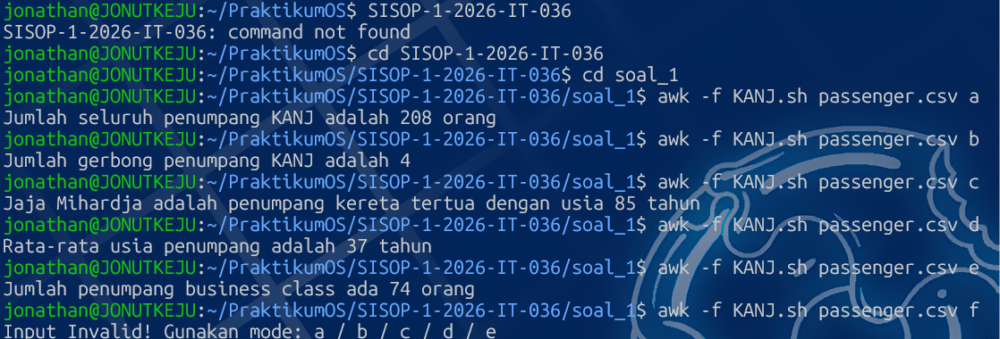

# SISOP-1-2026-IT-036

| Modul 1 |     Identitas Praktikan     |
|---------|-----------------------------|
| Nama    | Jonathan Steven Tjahjaputra |
| NRP     | 5027251036                  |
| Kelas   | Sistem Operasi B            |
| Asisten | SCRA                        |

## soal_1 : ARGO NGAWI JESGEJES

### 1. Deskripsi Soal
1. Dataset `passenger.csv` harus diunduh ke folder `soal_1`.
2. Script diketik dalam file `KANJ.sh`.
3. Format pemanggilan fungsi pada script adalah :
  ```sh
  awk -f KANJ.sh passenger.csv <opsi>
  ```
4. Opsi `a` : Hitung jumlah penumpang kereta.
5. Opsi `b` : Hitung jumlah gerbong yang dipakai.
6. Opsi `c` : Cari penumpang tertua lalu panggil nama serta usianya.
7. Opsi `d` : Hitung rata-rata usia penumpang (tanpa angka belakang koma).
8. Opsi `e` : Hitung jumlah penumpang business class.
9. Opsi invalid (diluar a / b / c / d / e) akan mengoutput pesan invalid.

### 2. Penjelasan
Dimulai dengan setup : Buat folder `soal_1`, unduh `passenger.csv` lalu copy ke WSL lebih tepatnya ke dalam folder `soal_1`,
buat script dengan menjalankan `micro KANJ.sh`.
```sh
BEGIN {
    FS=","
    RS="\r\n"
    mode = ARGV[2]
    ARGV[2] = ""
}
```
1. `FS=","` : Menentukan bahwa pemisah kolom adalah koma (format CSV).
2. `RS="\r\n"` : Mengabaikan enter (\n) dalam pembacaan kolom terakhir (Untuk mencari jumlah gerbong)
3. `NR==1 {next}` : Mengabaikan baris pertama (header).
4. `ARGV[2]` : Menjadikan input setelah `passenger.csv` pada format pemanggilan fungsi sebagai `mode`
Mengambil parameter mode (a / b / c / d / e).


Setelah itu, fungsi dijalankan internal dengan membaca isi `passenger.csv`.
```sh
NR==1 { next }

{
    total++

    carriage[$4]++

    if ($2 > max_age) {
        max_age = $2
        oldest = $1
    }

    sum_age += $2

    if ($3 == "Business") {
        business++
    }
}
```
1. Blok `NR==1 { next }` fungsinya mengabaikan header pada `passenger.csv` yaitu
   `Nama Penumpang | Usia | Kursi Kelas | Gerbong`
2. Blok tanpa nama akan dijalankan saat awk dipanggil, membaca setiap baris pada `passenger.csv`.
3. `total` akan menambah jumlah dirinya sebanyak 1 setiap kali baris dibaca (Jumlah Penumpang).
4. `carriage` akan menyimpan data unik pada kolom 4 (kolom gerbong), secara tidak langsung
   menghitung jumlah gerbong.
5. Blok `if` akan membandingkan kolom 2 pada baris saat ini dengan yang sebelumnya. Jika lebih besar,
   maka kolom 1 (Nama Penumpang) adalah penumpang tertua. Ini akan terus dibandingkan perbaris, yang
   nantinya akan menahan data kolom 1 dan 2 penumpang tertua hingga baris terakhir dibaca.
6. `sum_age` akan menjumlahkan umur (kolom 2) dari setiap baris. Formula rata-rata tidak dijalankan di blok
   ini karena blok sekarang adalah blok perulangan.
7. Blok `if` akan mendeteksi kolom 3 (Kursi Kelas). Jika sel tersebut terdata `Business`, maka jumlah
   variabel `business` bertambah satu.


Dan terakhir untuk bagian per-outputannya,
```sh
END {
    if (mode == "a") {
        print "Jumlah seluruh penumpang KANJ adalah " total " orang"
    }
    else if (mode == "b") {
        print "Jumlah gerbong penumpang KANJ adalah " length(carriage)
    }
    else if (mode == "c") {
        print oldest " adalah penumpang kereta tertua dengan usia " max_age " tahun"
    }
    else if (mode == "d") {
        if (total > 0)
            avg = int(sum_age / total)
        else
            avg = 0
        print "Rata-rata usia penumpang adalah " avg " tahun"
    }
    else if (mode == "e") {
        print "Jumlah penumpang business class ada " business " orang"
    }
    else {
        print "Input Invalid! Gunakan mode: a / b / c / d / e"
    }
}
```
1. Blok `END {}` akan dijalankan setelah semua file berhasil dibaca (dalam konteks ini, `passenger.csv`).
2. awk dengan mode `a`,`c`, dan `e` akan langsung memanggil variabel pada blok tanpa nama.
3. awk `b` memiliki tambahan fungsi `length(_)` yang akan mengukur besar array `carriage`. Hal ini dikarenakan
   data gerbong unik disimpan ke satu "bilik" array, sehingga mengukur lengthnya akan menunjukkan jumlah gerbong.
4. awk `d` menjalankan formula rata-rata terlebih dahulu. Terdapat blok `if` untuk error handling jika pembagi
   adalah nol. Dilakukan dengan menyimpan hasil formula atau nol ke `avg`.
5. awk yang memanggil invalid input akan menampilkan teks invalid seperti pada kode.


### 3. Output



## soal_2 : EKSPEDISI PESUGIHAN GUNUNG KAWI - MAS AMBA


